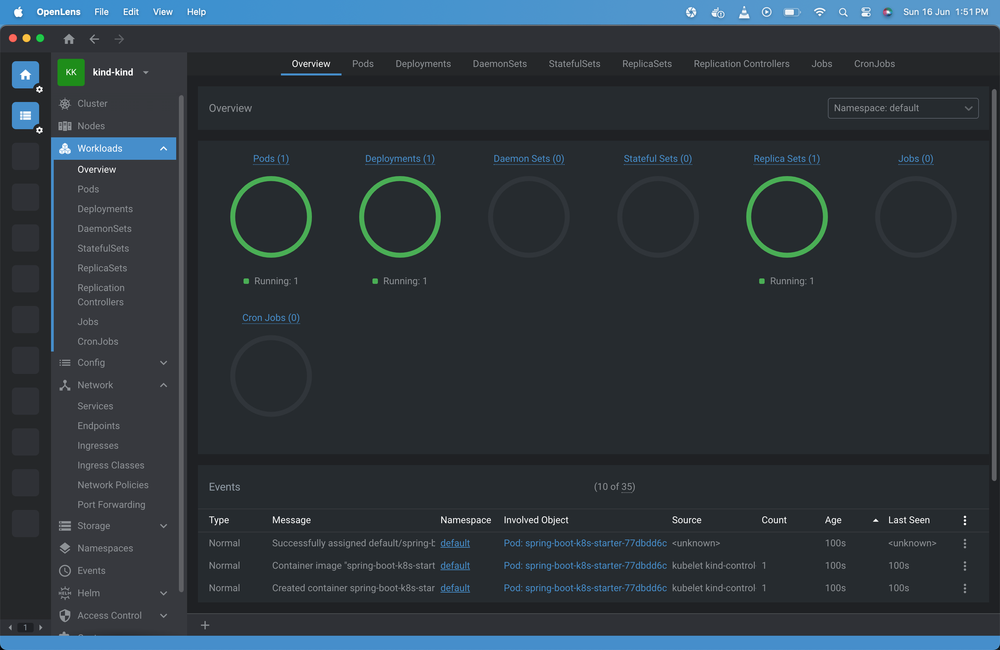
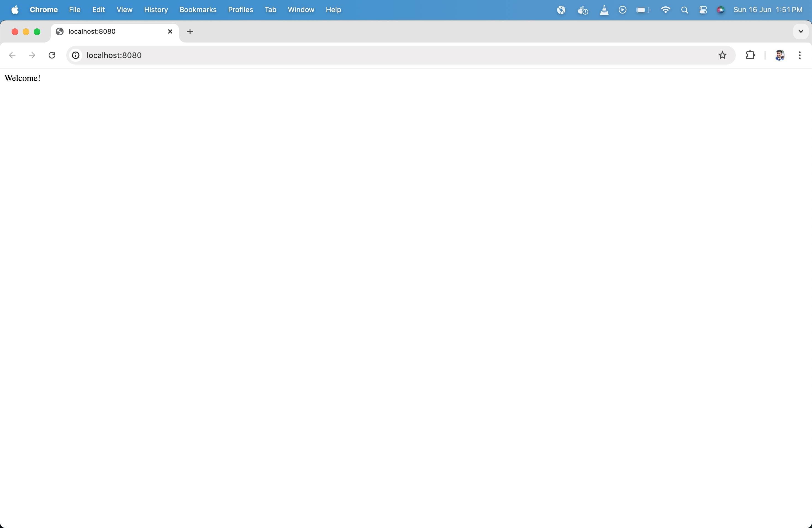

# Spring Boot Application Ready for Kubernetes(K8s)

This is a Spring Boot application built with Java 17. The project includes a Dockerfile for containerization and deployment to a Kubernetes cluster using a `app-deployment.yaml` file.

## Table of Contents

- [Prerequisites](#prerequisites)
- [Getting Started](#getting-started)
- [Building the Docker Image](#building-the-docker-image)
- [Load Image to Kind Cluster](#load-image-to-kind-cluster)
- [Deploying to Kubernetes](#deploying-to-kubernetes)
- [Project Structure](#project-structure)
- [Pod Deployment](#pod-deployment)
- [Application Running](#application-running)

## Prerequisites

- Java 17
- Maven
- Docker
- Kind for Kubernetes cluster
- OpenLens for visualization of cluster
- Helm

## Getting Started

Fork the repository and then clone it in your local sytem:

```bash
git clone https://github.com/{yourusername}/{your-repo-name}.git
cd {your-repo-name}
```

Do a maven clean package
```bash
mvn clean package
```

## Building the Docker Image

- Build the project using Maven and Docker: The Dockerfile is a multi-stage build that first uses a Maven image to build the project, and then an OpenJDK 17 image to run it.
- Build the Docker image: 
```bash
docker build -t spring-boot-k8s-starter:1.0 .
```

## Load Image to Kind Cluster

```bash
kind load docker-image spring-boot-k8s-starter:1.0 --name kind
```

## Deploying to Kubernetes
For Windows:
```bash
kubectl apply -f .\blueprints\app-deployment.yaml
```
For Linux/MacOs
```bash
kubectl apply -f ./blueprints/app-deployment.yaml
```

## Project Structure

```java
spring-boot-k8s-starter/
├── blueprints/
│   └── app-deployment.yaml
├── src/
│   ├── main/
│   │   ├── java/
│   │   └── resources/
│   └── test/
│       ├── java/
│       └── resources/
├── Dockerfile
├── pom.xml
└── README.md
```

## Pod Deployment



## Application Running

